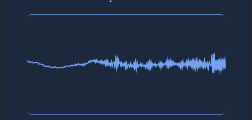
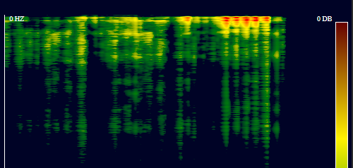

# Web Audio API Demos

This repo is for  demonstrating  different aspects of the Web audio API.

## Current Demos
### Waveform 
 
  
  
  
  [source code](/waveform) | [live demo](https://spkellywaveform.surge.sh)
### Spectrogram 
  
  

  [source code](/spectrogram) | [live demo](https://spkellyspectrogram.surge.sh)

## Resources
* [MDN Article on the Web Audio API](https://developer.mozilla.org/en-US/docs/Web/API/Web_Audio_API)
* [Documentation on getting microphone and video input](https://developer.mozilla.org/en-US/docs/Web/API/MediaDevices/getUserMedia)
* [Web Audio Basic Concepts](https://developer.mozilla.org/en-US/docs/Web/API/Web_Audio_API/Basic_concepts_behind_Web_Audio_API)